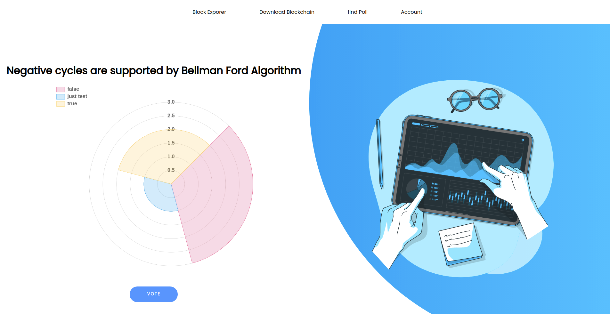

# VoteChain - Blockchain-based Voting System

VoteChain is a blockchain-based voting system that aims to provide a secure and transparent platform for conducting elections. This project utilizes RSA encryption for wallet management and Flask framework for the nodes. It implements a proof-of-work consensus mechanism for maintaining the integrity of the blockchain.

## Requirements

Technology used:

- Python 3.7 or earlier
- pycrypto
- Requests
- Flask
- Flask-CORS

## Home Page

## Sign Up

## Sign In

## OTP Verification

## Dashboard

## Create Poll

## Find Poll

## Vote

## Result

### Block Explorer

